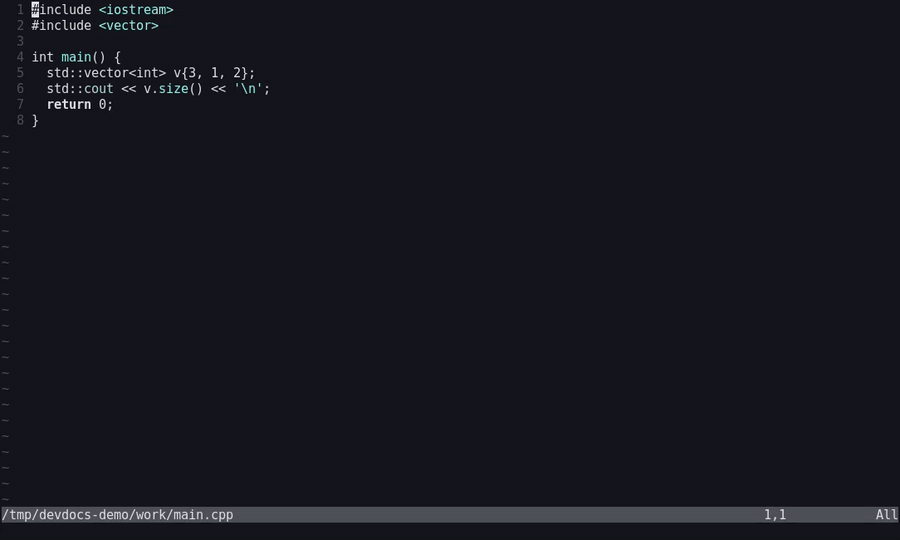
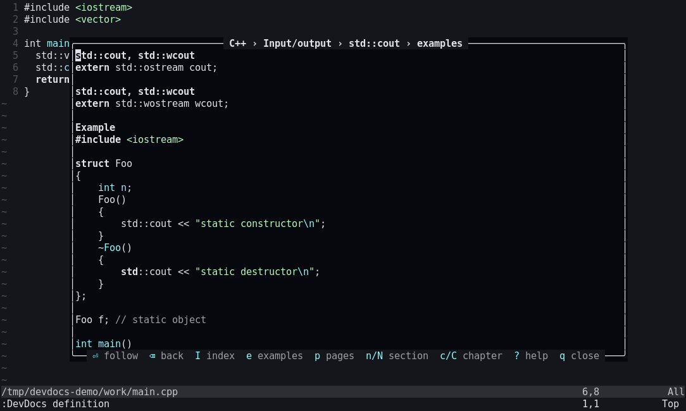
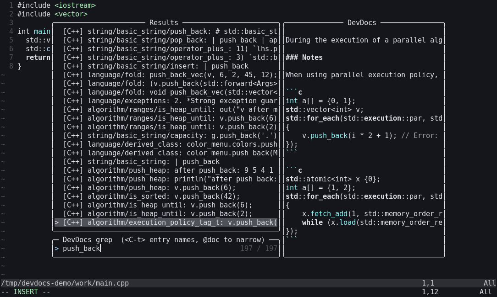
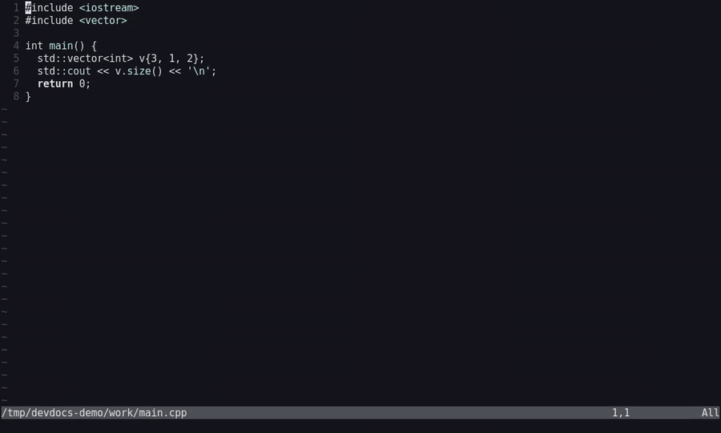
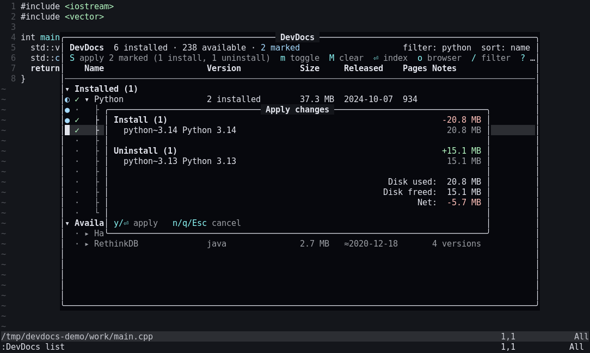
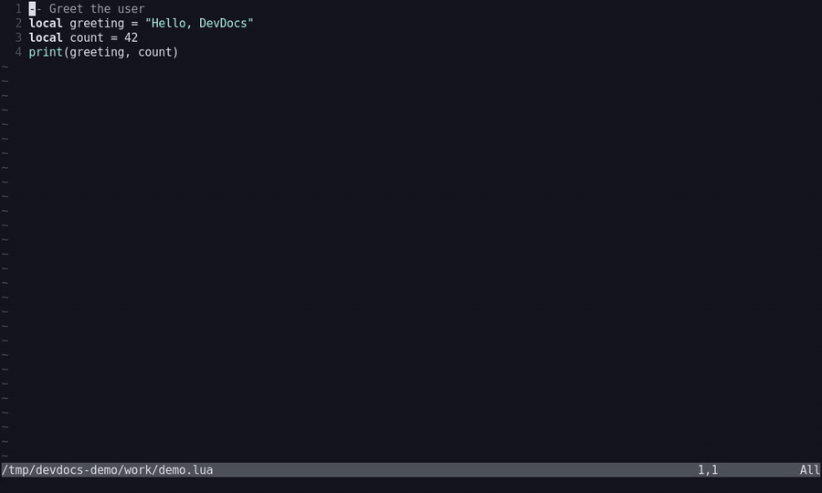
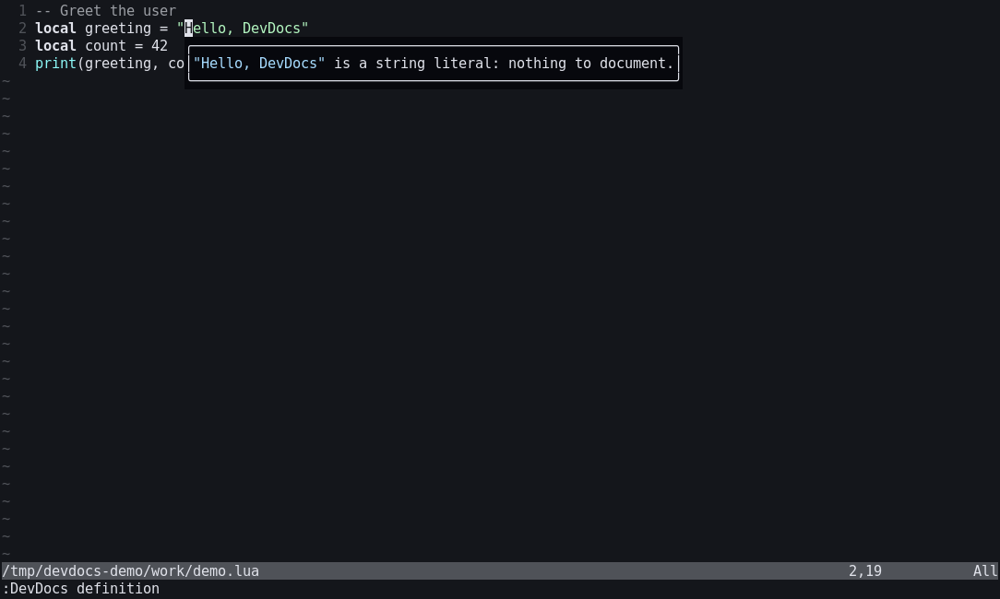
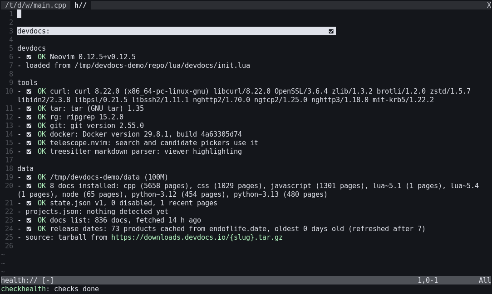

# devdocs.nvim

Offline [devdocs.io](https://devdocs.io) documentation inside Neovim. Docs are
downloaded per language and version (the version your project uses, or the
newest), converted once to markdown, and read from disk: the symbol under the
cursor opens its page in a float, examples come up on their own, every
installed doc is grepped with ripgrep, and a Mason-like manager installs,
updates and removes docs.



The data comes from the same files devdocs' own `thor docs:download` uses
(one tarball per doc from `downloads.devdocs.io`, the docs list from
`devdocs.io/docs.json`), or from a self-hosted devdocs, or from a local
mirror built by `:DevDocs mirror`.

## Dependencies

| Dependency | | Without it |
|---|---|---|
| Neovim 0.11+ | required | - |
| `curl`, `tar` | required | docs can't be downloaded or extracted |
| `rg` (ripgrep) | required for search | `:DevDocs search` reports `rg is not installed`; lookups, the viewer and the manager still work |
| treesitter `markdown` parser | required (ships with Neovim) | the viewer shows plain text, no highlighting |
| [telescope.nvim](https://github.com/nvim-telescope/telescope.nvim) | optional | search results go to the quickfix list, and an ambiguous lookup asks through `vim.ui.select` |
| treesitter parsers for your languages | optional | `std::cout`, `os.path.join`, `arr.map` can't be read from the syntax tree; the word under the cursor is looked up instead |
| language servers (`lua_ls`, pyright, …) | optional | the doc version comes from project files, the shebang or `<tool> --version` instead of the server's settings |
| [mason.nvim](https://github.com/mason-org/mason.nvim) | optional | an empty `import.docs` derives nothing; docs are still installed per buffer (`install_as_needed`) |
| `git`, `docker` | optional | no `:DevDocs mirror` (building a local mirror of every doc) |

`:checkhealth devdocs` checks all of these.

## Install

### lazy.nvim

```lua
{
  "hosua/devdocs.nvim",
  dependencies = {
    "nvim-telescope/telescope.nvim", -- optional: search and candidate pickers
    "nvim-lua/plenary.nvim", -- telescope's own dependency
  },
  cmd = { "DevDocs", "DevDocsInstall", "DevDocsShowDefinition", "DevDocsShowExample", "DevDocsSearch", "DevDocsList" },
  event = "VeryLazy", -- so install_as_needed and the import sync run without a keypress
  opts = {},
}
```

<details><summary>vim.pack (built in, Neovim 0.12+)</summary>

```lua
vim.pack.add({
  "https://github.com/hosua/devdocs.nvim",
  "https://github.com/nvim-lua/plenary.nvim", -- for telescope
  "https://github.com/nvim-telescope/telescope.nvim", -- optional: search and candidate pickers
})
require("devdocs").setup({})
```

</details>

<details><summary>vim-plug</summary>

```vim
Plug 'hosua/devdocs.nvim'
Plug 'nvim-lua/plenary.nvim'          " for telescope
Plug 'nvim-telescope/telescope.nvim'  " optional: search and candidate pickers
" after plug#end():
lua require("devdocs").setup({})
```

</details>

<details><summary>Manual</summary>

```bash
git clone https://github.com/hosua/devdocs.nvim ~/.local/share/nvim/site/pack/plugins/start/devdocs.nvim
```

Then call `require("devdocs").setup({})` in `init.lua`.

</details>

The `:DevDocs` commands exist without `setup()`, but `setup()` starts
`install_as_needed` and the import sync, so call it (lazy.nvim's `opts` does).
On first use the docs list is fetched and cached for a day; nothing is
downloaded until a buffer needs a doc (`install_as_needed`), `import.docs`
asks for one, or you install one.

### Configurations

**Minimal**: install docs for whatever you open, in a float.

```lua
opts = {}
```

**Ask before downloading, pick docs up front**: for slow or metered
connections. Nothing installs without a yes, and the listed docs stay
installed.

```lua
opts = {
  install_as_needed = "prompt",
  import = { docs = { "lua~5.4", "python*", "javascript", "css" }, recent_only = true },
}
```

**Side split, LSP hover as fallback**: docs open next to your code; a symbol
with no devdocs entry falls back to `vim.lsp.buf.hover()`.

```lua
opts = {
  view = { mode = "vsplit" },
  lookup = { fallback = "lsp_hover" },
}
```

**Offline mirror**: after `:DevDocs mirror`, install and update from the
local tree instead of the CDN.

```lua
opts = {
  install = {
    source = "json",
    doc_url = "file://" .. vim.fn.stdpath "data" .. "/devdocs/mirror/devdocs/public/docs/{slug}/{file}",
    manifest_url = "file://" .. vim.fn.stdpath "data" .. "/devdocs/mirror/devdocs/public/docs/docs.json",
  },
}
```

Every option and its default: [Configuration](#configuration). Suggested
keymaps: [Keymaps](#keymaps).

## Commands

One command with subcommands, plus flat aliases for each action.

| `:DevDocs …` | alias | what it does |
|---|---|---|
| `definition [text]` | `:DevDocsShowDefinition` | page/section for the symbol under the cursor, the visual selection, or `text` |
| `example [text]` | `:DevDocsShowExample` | only the code examples of that entry |
| `open <doc> [entry]` | `:DevDocsOpen` | open a doc by slug/name (`python`, `css`, `node~22_lts`), optionally at an entry |
| `search [query]` | `:DevDocsSearch` | grep the buffer's docs, then the newest version of every other enabled doc; `@css …` narrows to one doc (any version: `@python~3.9`) |
| `list` | `:DevDocsList` | the manager |
| `install [doc]` | `:DevDocsInstall` | docs for the current buffer (right version), or a named doc. `!` reinstalls |
| `install-all` | `:DevDocsInstallAll` | every doc devdocs offers (asks; `!` skips the question). Installed docs that are current are skipped; outdated ones are updated |
| `uninstall <doc>` | `:DevDocsUninstall` | remove a doc (asks; `!` skips) |
| `prune [lang]` | `:DevDocsPrune` | delete old versions. Per language it keeps (1) the newest installed version that is enabled, or the newest installed one when every installed version is disabled — versions compare across the docs list and the installed `meta.json`, so an install newer than the docs list is kept — and (2) every installed version a project pins in `projects.json` (the version detected for that project resolves to it); it deletes the other installed versions. `lang` limits it to one language. Asks with the full list and names any pinned versions it kept (`!` skips). A language with one installed version is never touched |
| `update [doc]` | `:DevDocsUpdate` | reinstall one doc, or every installed doc the docs list shows as newer |
| `sync` | | install what `import.docs` (or the Mason-derived defaults) asks for |
| `status` | | running install jobs |
| `detect` | | what this buffer resolved to: project root, language and how it was found, the doc version and where that came from |
| `resync` | | forget what was detected for this buffer's project (and tool versions) and detect again. `!` forgets every project |
| `recent` | | pages viewed recently |
| `mirror [--force] [--scrape]` | `:DevDocsForceCloneAndScrape` (= `--force`) | clone freeCodeCamp/devdocs, pull every doc through its container, install-all from that tree |

Completion covers subcommands and doc slugs.

## Keymaps

None are installed. Suggested:

```lua
local map = vim.keymap.set
map({ "n", "v" }, "<leader>ds", "<cmd>DevDocs definition<cr>", { desc = "devdocs show definition" })
map({ "n", "v" }, "<leader>de", "<cmd>DevDocs example<cr>", { desc = "devdocs show example" })
map("n", "<leader>df", "<cmd>DevDocs search<cr>", { desc = "devdocs search all docs" })
map("n", "<leader>dl", "<cmd>DevDocs list<cr>", { desc = "devdocs list / manage docs" })
map("n", "<leader>di", "<cmd>DevDocs install<cr>", { desc = "devdocs install docs for this buffer" })
map("n", "<leader>dI", ":DevDocs install ", { desc = "devdocs install a named doc" })
map("n", "<leader>da", "<cmd>DevDocs install-all<cr>", { desc = "devdocs install all docs" })
map("n", "<leader>dr", "<cmd>DevDocs resync<cr>", { desc = "devdocs re-detect project languages/versions" })
```

Inside the **viewer**:

| key | |
|---|---|
| `q`, `<Esc>` | close |
| `o` | open this page on devdocs.io |
| `y` | yank the devdocs.io url |
| `<CR>`, double-click | follow the link under the cursor (links between docs stay in the viewer) |
| `<BS>`, `u` | back (through links, `e` and `p`, to where the cursor was) |
| `e` | only the examples of this section (whole page's examples when it has none) |
| `p` | the whole page, scrolled to the section you were reading (`<BS>` returns to the section) |
| `s` | search inside this doc |
| `?` | help |



Inside the **search picker** (telescope): `<C-t>` toggles grep / entry-name
mode, `<CR>` opens in the viewer, `<C-x>` / `<C-v>` open in a split /
vsplit, `<C-o>` opens the page in the browser, `<C-y>` yanks
its url. Start the prompt with `@slug ` to search one doc.



Inside the **manager** each language is listed once, under *Installed* (any
version installed) or *Available*; `▸` expands it into every version DevDocs
has. The columns:



| column | |
|---|---|
| Version | the installed version (or `N installed`); `22.2.1 (current)` is DevDocs' rolling latest |
| Size | download size; a language sums its installed versions |
| Released | when that version of the docs was released; `≈` is an estimate from DevDocs' last update |
| Pages | pages installed |
| Notes | progress, failures, `update available` |

| key | |
|---|---|
| `j`/`k`, `↑`/`↓`, `gg`/`G`, `<C-d>`/`<C-u>`, `PgUp`/`PgDn`, wheel | move |
| `}` / `{` | next / previous section |
| `<Tab>`, `l`, `h` | expand / collapse a language's versions (`h` on a version folds it) |
| `i` | install the version under the cursor; on a language, its installed current version or the newest |
| `X` | uninstall (asks); on a language, every installed version the filter shows |
| `m` | mark / unmark the doc under the cursor, installed or not, and move down. On a language: its installed versions the filter shows, or its newest version when none is installed (expand it to mark an older one). A version that is installing can not be marked. Marks survive filter changes; the status line shows `N marked` and the buffer shows as modified (`[+]`) |
| `:w`, `S` | apply the marks: install every marked doc that is not installed and uninstall every marked one that is. A menu in the middle of the screen lists both groups first: `Install (N)` with the disk the downloads take (`-12.3 MB`, red, `DevDocsCost`) and `Uninstall (N)` with the disk they free (`+45.6 MB`, green, `DevDocsFreed`), then, right-aligned at the bottom in normal text, `Disk used` and `Disk freed` (each left out when its group is empty) and `Net` = freed - used (`+33.3 MB` green when space is gained, `-X MB` red when it is consumed, `0 B` when even); it also says how many marks the filter hides; `y`/`<CR>` applies, `n`/`q`/`<Esc>` cancels. Applied marks clear; marks whose install or uninstall failed stay. `:wq` / `:x` apply and then close the list (a cancelled menu keeps it open). With marks pending, `:q` refuses (E37) like any modified buffer; `q` / `<Esc>` close anyway and drop the marks |
| `V`/`v` … `m` | mark every doc in the visual selection (again: unmark) |
| `V`/`v` … `X` or `d` | uninstall the installed docs in the visual selection (asks) |
| `M` | clear every mark |
| `D` | prune this language (asks): keep its newest enabled installed version and any version a project pins, delete the rest; same rule as `:DevDocs prune` |
| `gD` | the same for every language, like `:DevDocs prune` (asks) |
| `u` / `U` | update it (a language: its outdated versions) / every outdated doc |
| `e` | enable / disable it for lookups and search |
| `<CR>`, double-click | open in the viewer |
| `o` | open on devdocs.io |
| `/` | live filter (`<Esc>` clears, `<CR>` keeps) |
| `s` | sort by name / size |
| `r` | refresh the docs list |
| `A` | install every doc (asks) |
| `?` | help |
| `q`, `<Esc>` | close |

**Marked mode.** While any mark is pending, the hint line under the status
line switches to `S apply 3 marked (2 install, 1 uninstall)  m toggle  M clear  ⏎ open  / filter  ? help  q close`, so the bulk apply is always on screen.
`i`, `X`, `V`…`X`/`d` and `u` do nothing then (they would act on one row
behind the plan's back) and say `N marked: S applies them (M clears)`;
apply with `S` / `:w` or clear with `M` to get them back. `D`, `gD`, `U`
and `A` still work (they ask first).



The date next to each doc is when that version was **released upstream**
(e.g. `angular~22` → 2026-06-03, `python~3.12` → 2023-10-02), taken from the
[endoflife.date API](https://endoflife.date/docs/api/v1/) (`/api/v1/products/<product>`: each
release cycle's `releaseDate`). Answers are cached per product in
`data_dir/releases/` for 7 days; the list shows the cache at once and fills in
the rest in the background. A date marked `≈` is the DevDocs build date
(`mtime` in docs.json): no upstream release date is known for that doc (CSS,
HTML, C, ... have no versions upstream), or it could not be fetched (offline:
the stale cache is used, nothing is reported). Set
`list = { release_dates = false }` to make no requests and show build dates only.

## How a lookup picks its docs

A lookup searches only the docs of the buffer's language, in the version its
project uses, so it stays instant with hundreds of docs installed.

1. **Language**: `extra_filetypes`, file-name rules (`package.json`,
   `Dockerfile`, `.npmrc`, …) and the filetype, all merged. If none of
   those match, the first of: the file extension (`.hh`, `.cppm`, `.tofu`, `.pyi`, … for buffers whose filetype is
   empty or unknown), the shebang (`#!/usr/bin/env -S python3.12`), then shell
   dotfiles (`.bashrc`, `.xinitrc`, other `*rc` files) as your `$SHELL`.
   Nothing matched: the newest enabled version of every installed doc.
2. **Version**, only for docs with more than one installed version (and
   not with `import.recent_only = true`): an
   attached language server (`lua_ls` `Lua.runtime.version`, pyright's
   `python.pythonPath`), a version in the shebang, the project's files
   (`.nvmrc`, `.python-version`, `pyproject.toml`, `go.mod`, `.luarc.json`,
   `node_modules/typescript`, …), then the installed tool (`fish --version`).
   Nothing found: the newest.
3. **Project root**: the enclosing git repository, else the nearest marker
   (`package.json`, `pyproject.toml`, …). `/` and `$HOME` never count, so a
   dotfiles repo in your home is not one big project. Version files are read
   in the nearest package first, then the repo root.

Answers are cached per buffer for the session and per project in
`projects.json`, with the size and mtime of every file that was looked at.
The first time a session touches a project those files are checked again, so
editing `.nvmrc` is noticed on the next start. `:DevDocs resync` forces it now;
`:DevDocs detect` shows what was decided and why. `lookup.scope = "all"` brings
back searching every enabled installed version after the buffer's own docs,
in lookups and `:DevDocs search`.

### Keywords vs. your own names

`definition` and `example` on the word under the cursor first ask what kind
of name it is (`lookup.smart`, on by default). LSP semantic tokens answer when
the server sends them (`defaultLibrary` marks library names); otherwise the
treesitter highlight captures of the buffer's parser do. Treesitter alone only
calls a name a project variable when the buffer's locals query finds where it
is declared (nvim-treesitter's; Neovim itself ships none, so for lua and c the
plugin bundles a small one), so a library name used as a value (`error` in `pcall(error, 'x')`,
C's `errno`) still goes to the docs first. Only the word the cursor is on is
classified.

| under the cursor | what happens |
|---|---|
| keyword or builtin (`return`, `int`, `print`, `printf`) | the doc page, as always |
| a local variable, parameter or field the project declared (`count` in `local count = 1`) | LSP hover, no doc lookup (a popup saying it has no documentation when the hover is empty or no client can hover; with `lookup.explain = false` the docs, as before) |
| a string or char literal, a comment, a number, whitespace, an operator or punctuation | a small popup at the cursor (`"DevDocs" is a string literal: nothing to document.`); no picker, no hover, no doc lookup |
| `true`, `false`, `nil`, `NULL`, `None` | the doc page when the docs have an exact entry (JS `null`, Python `None`), else the popup |
| a function, type, macro or variable declared in this file (`helper` in `local function helper()`) | the doc page when the docs have an exact entry, else hover, else the popup (`helper is a function (declared on line 3): no documentation.`) |
| anything else: a library name, a project function or type, a variable in a chain (`string.format`, `helper()`, `t.field`, `vim.api.nvim_create_user_command`), or a name nothing could place | the doc page when the docs have an entry named exactly that (`string.format()`, `print()`), else hover (the matches the docs did find, or `lookup.fallback`, when the hover is empty) |



What counts as a string, comment or number comes from the first source that
has an answer: the bundled lua and c parsers or any nvim-treesitter parser
(code injected into a string, as in `vim.cmd("set number")`, is not treated as
a string), else LSP semantic tokens, else Vim's `:syntax` groups. The popup
closes when the cursor moves, and a later hover replaces it. Library names and
undeclared or unknown identifiers behave as before, and explicit text or a
visual selection always looks up the docs. `lookup.explain = false` restores
the old behaviour: nothing is treated as trivial, and classifying needs a
client that can hover. The setting only matters while `lookup.smart = true`.



"Exactly that" means the qualified name, or the word itself when it is not
qualified: `vim.print` does not open lua's `print()`, and `vim.fn.insert`
does not offer `table.insert()`. `defaultLibrary` is no proof the docs have a
name either: lua_ls gives it to Neovim's `vim.*` API, which no devdocs doc
covers.

Hover is used only when an attached client implements `textDocument/hover`;
without one nothing is classified and everything goes to the docs. A hover
that comes back empty (every client errored or had nothing) counts as no
hover. A visual selection or an explicit
`:DevDocs definition <text>` is never second-guessed.

## Configuration

### Defaults

```lua
{
  -- Where docs, the manifest cache and state live. One directory; delete it to reset.
  data_dir = vim.fn.stdpath "data" .. "/devdocs",

  -- true: when a buffer's language has a devdocs entry that is not installed yet,
  -- download the version matching the project (or the newest) in the background.
  -- "prompt": ask first. false: only :DevDocs install / the list manager install.
  install_as_needed = true,

  import = {
    -- Docs to keep installed, by slug or display name; `*` globs, case-insensitive
    -- ("python*" matches every Python version, "Bootstrap" matches bootstrap~5).
    -- Empty: derived from the LSP servers Mason has installed (when mason is present).
    docs = {},
    -- Only the newest version of each listed doc.
    recent_only = false,
    -- The docs list is the whole allowlist: no FileType auto-install, no Mason defaults.
    import_only = false,
    -- Every version of each listed doc; lookups pick the version the buffer's project uses.
    all = false,
  },

  install = {
    -- Parallel downloads/conversions for install-all. Raise it (e.g. 6) when
    -- installing from a local devdocs mirror; the public CDN rate-limits.
    max_jobs = 2,
    -- "tarball": one .tar.gz per doc from tarball_url (what `thor docs:download` uses; default).
    -- "json": db.json + index.json from doc_url, for a self-hosted devdocs app
    -- ("http://localhost:9292/docs/{slug}/{file}", manifest "http://localhost:9292/docs.json")
    -- or a directory of downloaded docs ("file:///path/to/devdocs/public/docs/{slug}/{file}").
    source = "tarball",
    tarball_url = "https://downloads.devdocs.io/{slug}.tar.gz",
    doc_url = "https://documents.devdocs.io/{slug}/{file}",
    manifest_url = "https://devdocs.io/docs.json",
    tar = "tar",
    -- Seconds before the cached manifest (list of all docs) is refreshed.
    manifest_ttl = 86400,
    curl = "curl",
  },

  -- :DevDocs mirror (:DevDocsForceCloneAndScrape): clone freeCodeCamp/devdocs, pull every
  -- doc through its container into <dir>/public/docs, then install-all from that directory.
  mirror = {
    -- nil = <data_dir>/mirror/devdocs
    dir = nil,
    repo = "https://github.com/freeCodeCamp/devdocs",
    image = "ghcr.io/freecodecamp/devdocs:latest",
    docker = "docker",
    git = "git",
  },

  search = {
    rg = "rg",
    max_results = 200,
    -- Results from the current buffer's docs come first.
    prioritize_buffer_docs = true,
  },

  view = {
    -- "float" | "split" | "vsplit" | "tab"
    mode = "float",
    width = 0.8,
    height = 0.8,
    -- nil follows 'winborder'; otherwise any nvim_open_win border value.
    border = nil,
    wrap = true,
    -- conceallevel=2 in the viewer so markdown reads as text.
    conceal = true,
  },

  lookup = {
    -- When the symbol under the cursor has no doc entry:
    -- "search" opens the search picker with the word, "lsp_hover" calls vim.lsp.buf.hover(), "none" notifies.
    fallback = "search",
    -- "buffer": when the buffer's language is known, look only in its docs (the version
    -- its project uses); otherwise in the newest version of every doc.
    -- "all": the buffer's docs first, then every installed doc (slow with many docs installed).
    scope = "buffer",
    -- On :DevDocs definition / example, tell keywords and builtins from the project's own
    -- names (LSP semantic tokens, else treesitter): a local variable, parameter or field shows
    -- vim.lsp.buf.hover() instead of a doc page, and any other name the docs have no entry
    -- named exactly like (`vim.api.nvim_create_user_command`) shows hover before fuzzy matches
    -- or `fallback`. Only when an attached client can hover; an empty hover goes on to the
    -- docs, and a visual selection or an explicit argument always looks up the docs.
    smart = true,
    -- With smart: when the word under the cursor has nothing to document (a string, comment or
    -- number, true/false/nil the docs have no entry for, whitespace or an operator, or a variable or
    -- function declared in the file that hover has nothing on), a small popup at the cursor says so
    -- instead of the search picker or a wrong page. false: those go to the docs like any name.
    explain = true,
  },

  list = {
    -- Show when each doc's version was released upstream, from endoflife.date
    -- (cached for a week). false: no network calls; the list shows DevDocs build dates (≈).
    release_dates = true,
  },

  -- filetype -> { slug bases }, merged over the built-in table (lua/devdocs/langmap.lua).
  extra_filetypes = {},
  -- Mason package name -> { slug bases }, merged over the built-in table.
  extra_mason = {},

  hooks = {
    -- function(slug) after a doc finished installing
    on_install = nil,
    -- function(slug, path) when a page opens in the viewer
    on_open = nil,
  },

  notify = true,
}
```

How a buffer finds its docs: the filetype (and file name: `docker-compose.yml`,
`package.json`, `CMakeLists.txt`…) maps to doc *bases* (`cpp` → `cpp`, `c`;
`typescript` → `typescript`, `javascript`, `node`, `dom`). For a base with
several versions, the project's version is read from files at the project
root (`.nvmrc`, `package.json`, `.python-version`, `pyproject.toml`, `go.mod`,
`.ruby-version`, `composer.json`, `pom.xml`, `build.gradle`, `.luarc.json`,
`CMakeLists.txt`, `project.godot`, `mix.exs`…) and the closest doc version
not newer than it is used, else the newest. Add your own with
`extra_filetypes` and `extra_mason`.

### A sample configuration

```lua
{
  "hosua/devdocs.nvim",
  cmd = { "DevDocs" },
  event = "VeryLazy",
  opts = {
    install_as_needed = "prompt",
    import = { docs = { "css", "html", "javascript", "python*", "Bootstrap" }, all = true },
    install = { max_jobs = 4 },
    view = { mode = "vsplit" },
    lookup = { fallback = "lsp_hover" },
    extra_filetypes = { gleam = { "gleam" } },
    hooks = {
      on_install = function(slug)
        vim.notify("docs ready: " .. slug)
      end,
    },
  },
}
```

### Installing everything

`:DevDocs install-all` downloads every doc (about 8.7 GB of HTML as of
2026-09, converted to a similar amount of markdown) with `install.max_jobs`
parallel jobs and exponential backoff when the CDN answers 429. It is
resumable: installed docs that are current are skipped, outdated ones are
updated.

To avoid the public CDN entirely, `:DevDocs mirror` clones
[freeCodeCamp/devdocs](https://github.com/freeCodeCamp/devdocs) into
`<data_dir>/mirror/devdocs`, runs
`docker run --rm -v <clone>/public/docs:/devdocs/public/docs ghcr.io/freecodecamp/devdocs:latest thor docs:download --all`
in a terminal split, then installs everything from that tree. `--force`
re-clones first; `--scrape` runs `thor docs:generate` for the slugs you name
(scraping upstream sites, slow). To keep using the mirror in later sessions:

```lua
install = {
  source = "json",
  doc_url = "file://" .. vim.fn.stdpath "data" .. "/devdocs/mirror/devdocs/public/docs/{slug}/{file}",
  manifest_url = "file://" .. vim.fn.stdpath "data" .. "/devdocs/mirror/devdocs/public/docs/docs.json",
  max_jobs = 6,
}
```

A running self-hosted devdocs works the same way with
`doc_url = "http://localhost:9292/docs/{slug}/{file}"` and
`manifest_url = "http://localhost:9292/docs.json"`.

## Data on disk

Everything is under `data_dir` (`stdpath("data")/devdocs`):

```
manifest.json                 cached docs.json  { version, fetched_at, docs }
state.json                    { version = 1, enabled = { slug = false }, recent = [...] }
projects.json                 { version = 1, roots = { [dir] = { bases, files } }, tools = { [exe] = { v, stamp } } }  detection cache
docs/<slug>/meta.json         { version = 1, slug, name, doc_version, release, mtime, installed_at, page_count, entry_count, skipped }
docs/<slug>/entries.tsv       name <TAB> path <TAB> type, one entry per line
docs/<slug>/anchors.json      { version = 1, pages = { [page] = { [fragment id] = line } } }
docs/<slug>/pages/<path>.md   one markdown file per page (path characters outside [A-Za-z0-9._-] percent-encoded)
releases/<product>.json       endoflife.date release cycles  { version, fetched_at, product, cycles }  (cache, safe to delete)
tmp/                          staging for installs in progress
mirror/                       :DevDocs mirror clone
```

Deleting `docs/<slug>` by hand is the same as `:DevDocs uninstall`. Deleting
the whole directory resets the plugin. Files with a `version` newer than the
plugin knows are never overwritten.

## Highlight groups

All `default = true` links; override them in your colorscheme (or after
`setup()`), e.g. `vim.api.nvim_set_hl(0, "DevDocsKey", { fg = "#21BFC2" })`.

Every key hint (the manager's hint line and help, the viewer footer and
help, the apply menu) draws the key in `DevDocsKey` and its action in
`DevDocsDim`. `DevDocsKey` links to `@type.builtin`, so it follows the
theme's builtin-type color: teal `#13C299` in NvChad's starlight theme,
cyan `#8cf8f7` in Neovim's default scheme (also what NvChad shows until its
treesitter highlights load). `Special` was not used because starlight makes
it red (`#FF4D51`). Marks (`DevDocsMark`, `DiagnosticHint`) stay a different hue: purple in
starlight, light blue in the default scheme.

| group | default |
|---|---|
| `DevDocsNormal` | `NormalFloat` |
| `DevDocsBorder` | `FloatBorder` |
| `DevDocsTitle` | `FloatTitle` |
| `DevDocsFooter` | `Comment` |
| `DevDocsHeader` | `Title` |
| `DevDocsDim` | `Comment` |
| `DevDocsMatch` | `Search` |
| `DevDocsInstalled` | `DiagnosticOk` |
| `DevDocsOutdated` | `DiagnosticWarn` |
| `DevDocsError` | `DiagnosticError` |
| `DevDocsProgress` | `DiagnosticInfo` |
| `DevDocsKey` | `@type.builtin` |
| `DevDocsLink` | `Underlined` |
| `DevDocsMark` | `DiagnosticHint` |
| `DevDocsCost` | `DiagnosticError` |
| `DevDocsFreed` | `DiagnosticOk` |
| `DevDocsNote` | `NormalFloat` |
| `DevDocsNoteSubject` | `Identifier` |

`DevDocsNote` and `DevDocsNoteSubject` color the "nothing to document" popup
(`lookup.explain`): its text, and the word or literal it names.

## Hooks and API

`hooks.on_install(slug)` and `hooks.on_open(slug, path)` are called in
`pcall`. `require("devdocs")` exposes `definition()`, `example()`,
`open(doc, entry)`, `search(query)`, `install(slug, { force })`,
`install_all({ yes })`, `uninstall(slug, { yes })`, `prune({ base, yes })`,
`update(slug)`, `sync()`,
`status()`, `recent()` and `statusline()` (a short progress string while
installs run, `""` otherwise, for your statusline).

## Troubleshooting

`:checkhealth devdocs` reports the Neovim version, which copy of the plugin
is loaded, the tools it found, the data directory and its size, installed
docs, the docs list age, the release dates cache and the install source.



- **"no docs installed for this buffer"**: `:DevDocs install` fetches the
  right ones; `:DevDocs list` shows what exists. Unknown filetypes need
  `extra_filetypes`.
- **Installs fail with 429**: the CDN is rate-limiting. Jobs retry with
  backoff; lower `install.max_jobs`, or use `:DevDocs mirror`.
- **The wrong version opens**: `:DevDocs list` shows what is installed;
  `import.all = true` keeps every version and switches per project. The
  detected version comes from the project files listed above.

## Changelog

| Version | Highlights |
|---|---|
| [0.2.0](https://github.com/hosua/devdocs.nvim/releases/tag/v0.2.0) | `:DevDocs list` grouped by language with bulk delete/prune; faster scoped lookups; `p` opens at the current section |
| [0.1.0](https://github.com/hosua/devdocs.nvim/releases/tag/v0.1.0) | First release: installer, converter, viewer, search picker, list manager, mirror, checkhealth |

See [CHANGELOG.md](CHANGELOG.md) for release history.

## Development

```
make test          # unit specs, headless, no dependencies
make integration   # installs from a file:// fixture under a throwaway XDG tree
make smoke         # tmux screen tests (need DEVDOCS_DATA with cpp + lua~5.4 installed)
make golden        # regenerate the converter fixtures after a deliberate change
make check         # stylua --check
```

The HTML → markdown converter is pure Lua and runs in a child `nvim
--headless` process, so a 40 MB doc converts in a few seconds without
touching the editor.

## Attribution

Documentation content comes from devdocs.io and its upstream projects under
their own licenses; the test fixtures include short excerpts of MDN (CC-BY-SA),
cppreference (CC-BY-SA) and Python (PSF) pages.
